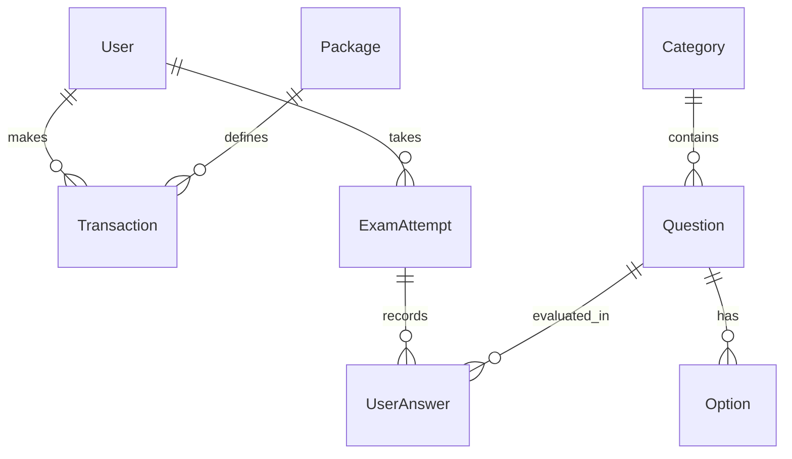

# PassSapa - Database Schema Specification (แบบจำลองฐานข้อมูล)

**เวอร์ชัน**: 1.2.0  
**ฐานข้อมูลเฟสพัฒนา (Dev Phase)**: SQLite (ผ่าน Prisma / Drizzle ORM)  
**ฐานข้อมูลเฟสใช้งานจริง (Production Phase)**: PostgreSQL (Supabase)

---

## 💡 ยุทธศาสตร์การเปลี่ยนผ่านฐานข้อมูล (Database Transition Strategy)

การใช้ **SQLite** ในเฟสเริ่มต้นช่วยให้การพัฒนาทำได้รวดเร็ว โดยเก็บข้อมูลไว้ในไฟล์ท้องถิ่น (Local File: `dev.db`) ไม่ต้องเชื่อมต่อ Cloud DB ชั่วคราว และเมื่อพร้อมปรับขึ้นระบบ Production สามารถสลับไปยัง **PostgreSQL (Supabase)** ได้ทันทีโดยไม่ต้องแก้ไขโค้ดแอปพลิเคชัน เนื่องจากใช้ **Prisma ORM** เป็นตัวกลางในการจัดการสคีมา

```prisma
// dev/prisma/schema.prisma (ตัวอย่างสคีมา Prisma สำหรับ SQLite & PostgreSQL)

datasource db {
  provider = "sqlite" // เปลี่ยนเป็น "postgresql" เมื่อ Deploy ขึ้น Production
  url      = env("DATABASE_URL")
}

generator client {
  provider = "prisma-client-js"
}

model User {
  id                String         @id @default(uuid())
  email             String         @unique
  fullName          String
  role              String         @default("STUDENT") // STUDENT | ADMIN
  createdAt         DateTime       @default(now())
  updatedAt         DateTime       @updatedAt
  transactions      Transaction[]
  examAttempts      ExamAttempt[]
}

model Package {
  id              String        @id // เช่น VET-1M, ALL-3M
  name            String
  subjectCategory String        // เวชกรรม | เภสัชกรรม | ผดุงครรภ์ | นวดไทย | กฎหมาย | ALL
  durationMonths  Int           // 1 | 3 | 6
  price           Float
  transactions    Transaction[]
}

model Transaction {
  id            String    @id @default(uuid())
  userId        String
  packageId     String
  amount        Float
  transRef      String    @unique // หมายเลขอ้างอิงสลิป
  slipImageUrl  String?
  status        String    @default("PENDING") // PENDING | SUCCESS | FAILED
  approvedAt    DateTime?
  createdAt     DateTime  @default(now())
  user          User      @relation(fields: [userId], references: [id])
  package       Package   @relation(fields: [packageId], references: [id])
}

model Category {
  id          String     @id // เวชกรรมไทย | เภสัชกรรมไทย | ผดุงครรภ์ไทย | นวดไทย | กฎหมายวิชาชีพ
  name        String
  description String?
  questions   Question[]
}

model Question {
  id              String       @id @default(uuid())
  categoryId      String
  scriptureRef    String       // เช่น คัมภีร์ตักกศิลา
  questionText    String
  imageUrl        String?      // รูปภาพสมุนไพร / จุดนวด
  correctOptionId String       // a | b | c | d
  explanation     String
  category        Category     @relation(fields: [categoryId], references: [id])
  options         Option[]
  userAnswers     UserAnswer[]
}

model Option {
  id         String   @id @default(uuid())
  questionId String
  optionKey  String   // a | b | c | d
  optionText String
  question   Question @relation(fields: [questionId], references: [id], onDelete: Cascade)
}

model ExamAttempt {
  id              String       @id @default(uuid())
  userId          String
  mode            String       // PRACTICE | MOCK
  totalQuestions  Int
  score           Int
  durationSeconds Int
  completedAt     DateTime     @default(now())
  user            User         @relation(fields: [userId], references: [id])
  userAnswers     UserAnswer[]
}

model UserAnswer {
  id               String      @id @default(uuid())
  attemptId        String
  questionId       String
  selectedOptionId String
  isCorrect        Boolean
  attempt          ExamAttempt @relation(fields: [attemptId], references: [id], onDelete: Cascade)
  question         Question    @relation(fields: [questionId], references: [id])
}
```

---

## 1. ผังความสัมพันธ์ข้อมูล (Entity Relationship Diagram - ERD)


