# PassSapa - Human-like End-to-End (E2E) & Full Flow Testing Protocol

**เวอร์ชัน**: 1.0.0  
**วัตถุประสงค์**: ระเบียบการทดสอบระบบเสมือนการใช้งานจริงของมนุษย์ (Human Emulation Testing) และการไล่ทดสอบตลอดเส้นทางเชื่อมโยง (Full Chain Flow Tracing) ตั้งแต่ต้นน้ำถึงปลายน้ำ

---

## 🤖 1. หลักการทดสอบเสมือนมนุษย์ (Human Emulation Principles)

การทดสอบจะไม่ใช่แค่การตรวจเช็กว่าโค้ดผ่านหรือไม่ แต่จะ **จำลองพฤติกรรมมนุษย์จริง 100%** รวมถึงเคสที่มนุษย์ใช้งานผิดพลาด (Edge Cases & User Errors):

1. **Invalid Input Emulation (ลองกรอกข้อมูลผิดแบบมนุษย์)**:
   * ลองกรอก Email ผิดรูปแบบ, รหัสผ่านสั้นไป, สลิปโอนเงินภาพเบลอ หรือกรอก `transRef` มั่ว ➔ ระบบต้องขึ้นข้อความเตือนสุภาพและเข้าใจง่าย ห้ามเด้งหน้าจอขาว (White Screen of Death)
2. **Interruption & Resiliency Emulation (ลองกดย้อนกลับ / รีเฟรช / ปิดแท็ป)**:
   * ทำข้อสอบอยู่แล้วเผลอกด **Refresh (F5)** หรือกด **Back** บนเบราว์เซอร์ ➔ ระบบต้องจำคำตอบที่ทำค้างไว้ และเวลานาฬิกาต้องเดินต่อไม่รีเซ็ต
3. **Multi-Device & Touch Check (ลองใช้บนมือถือ)**:
   * ตรวจสอบว่าปุ่มกด ชอยส์เลือก A-D และตารางข้อสอบบนโทรศัพท์มือถือ สามารถใช้นิ้วแตะได้สะดวก ไม่ซ้อนทับกัน

---

## 🔗 2. การไล่ทดสอบตั้งแต่ต้นน้ำถึงปลายน้ำ (Full Chain Flow Tracing)

เมื่อพัฒนาหรือแก้ไขฟังก์ชันใดก็ตาม ต้องทำการทดสอบย้อนกลับตั้งแต่จุดเริ่มต้น (Entry Point) ผ่านท่อ Wiring ทุกขั้นตอน ดังนี้:

```mermaid
graph TD
    subgraph "Full Chain 1: เส้นทางผู้เรียน (Student Full Journey)"
        S1[1. หน้าแรก Landing Page] -->|ลองกดทำข้อสอบตัวอย่าง 1 ข้อ| S2[2. ล็อกอิน / สมัครสมาชิก]
        S2 -->|เข้าสู่ระบบสำเร็จ| S3[3. หน้าหลัก Dashboard]
        S3 -->|เลือกทำข้อสอบจำลอง| S4[4. ห้องสอบ Mock Exam จับเวลา 180 นาที]
        S4 -->|ทำครบทุกข้อ กดส่ง| S5[5. หน้าสรุปผลสอบ & วิเคราะห์จุดอ่อน Radar Chart]
        S5 -->|กดสุ่มข้อสอบซ่อม| S6[6. ทำข้อสอบซ่อมเฉพาะคัมภีร์จุดอ่อน]
        S6 -->|กดอัปเกรด VIP| S7[7. เลือกแพ็กเกจ & สแกน PromptPay QR]
        S7 -->|แนบสลิป| S8[8. ระบบตรวจสลิป & เปิดสิทธิ์ VIP ทันที]
    end

    subgraph "Full Chain 2: เส้นทางแอดมิน (Admin Full Journey)"
        A1[1. ล็อกอินแอดมิน /admin] -->|ลากวางไฟล์ Excel| A2[2. ระบบตรวจเช็กข้อสอบซ้ำ & Preview]
        A2 -->|กดบันทึก| A3[3. ข้อสอบเข้าสู่ DB SQLite/PostgreSQL]
        A3 -->|กดยืนยันสลิปที่รอชำระ| A4[4. 1-Click Slip Approval]
        A4 -->|ตรวจสอบผู้ใช้| A5[5. สถานะผู้ใช้เปลี่ยนเป็น VIP ⭐ ทันที]
    end
```

---

## 🛡️ 3. กฎการทดสอบย้อนกลับเมื่อแก้ไขโค้ด (Zero Regression Policy)

* **กฎข้อที่ 1**: เมื่อมีการแก้ไขโค้ดในจุดใดก็ตาม (เช่น แก้ไขการคำนวณคะแนนในหน้าผลสอบ) **ห้ามทดสอบแค่หน้าผลสอบหน้าเดียว**
* **กฎข้อที่ 2**: ต้องไล่รันการทดสอบตั้งแต่หน้า Dashboard ➔ เข้าห้องสอบ ➔ ทำข้อสอบจนจบ ➔ แล้วค่อยตรวจหน้าผลสอบ เพื่อให้มั่นใจว่าท่อส่งข้อมูลก่อนหน้าไม่พัง
* **กฎข้อที่ 3**: ต้องทดสอบว่าประวัติการสอบถูกบันทึกลงตาราง `exam_attempts` และ `user_answers` ใน SQLite DB อย่างถูกต้องตรงตามความเป็นจริง
