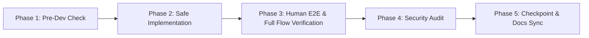

# PassSapa - Standard Operating Procedure (SOP) & QA Checklist

**เวอร์ชัน**: 1.3.0  
**วัตถุประสงค์**: คู่มือขั้นตอนการทำงานมาตรฐาน (SOP), การดึงบริบทเริ่มต้น (Bootstrap Protocol), รายการตรวจสอบคุณภาพ (QA Checklist 5 เฟส) และการอัปเดตไฟล์ Checkpoint / Changelog

---

## ⚡ 0. การเริ่มต้นการทำงานใน Conversation ใหม่ (Bootstrap Protocol)

**ทุกครั้งที่เริ่มการสนทนาใหม่ หรือย้ายแชท** AI Agent ต้องดำเนินการตาม 2 สเต็ปนี้ก่อนเริ่มงานเสมอ:
1. อ่านไฟล์ [MASTER_INDEX.md](file:///d:/Antigravity/PassSapa/dev/MASTER_INDEX.md) เพื่อดึงภาพรวม ดรรชนีสเปก และคลัง Skills ทั้งหมด
2. อ่านไฟล์ [CHANGELOG.md](file:///d:/Antigravity/PassSapa/dev/CHANGELOG.md) เพื่อเช็ก Checkpoint ล่าสุดว่าระบบถูกพัฒนาค้างไว้ที่จุดใด

---

## 📋 5 เฟสการทำงานมาตรฐาน (Standard Operating Procedure)

---

## 📌 ไฟล์ที่ต้องอัปเดตเป็น Checkpoint หลังพัฒนาเสร็จทุกครั้ง (Mandatory Checkpoint Files)

หลังการพัฒนา แก้ไข หรือปรับแต่งระบบเสร็จในแต่ละรอบ **ต้องทำการอัปเดตไฟล์ 3 กลุ่มนี้เสมอ**:

1. **`CHANGELOG.md`** (`d:/Antigravity/PassSapa/dev/CHANGELOG.md`):
   * บันทึกเลขเวอร์ชัน, วันเวลา, รายการฟังก์ชันที่เพิ่มขึ้น (**Added**), ส่วนที่แก้ไข (**Changed**), Bug ที่ได้รับการแก้ (**Fixed**), และสถานะ Checkpoint
2. **`walkthrough.md`** (`<artifacts>/walkthrough.md`):
   * สรุปผลการรันทดสอบและแสดงหลักฐานการใช้งานจริง (Verification Proof) ให้ผู้ใช้งานรับทราบและอนุมัติ
3. **ไฟล์ในหมวด `/docs`** (เมื่อมีการเปลี่ยนแปลงสเปก):
   * เพิ่ม/ปรับ DB ➔ อัปเดต `docs/DATABASE_SCHEMA.md`
   * เพิ่ม/ปรับ URL Route ➔ อัปเดต `docs/SITEMAP.md` และ `docs/USER_FLOW_AND_WIRING.md`
   * เพิ่มฟังก์ชัน ➔ อัปเดต `docs/REQUIREMENTS.md`

---

## 🔍 Checklist ตรวจสอบความถูกต้องรายเฟส (QA Verification Checklist)

### 1. Phase 1: Pre-Development Checklist (ก่อนเริ่มเขียนโค้ด)
- [ ] **1.1 Requirement Match**: อ่านและทำความเข้าใจเป้าหมายจาก [REQUIREMENTS.md](file:///d:/Antigravity/PassSapa/dev/docs/REQUIREMENTS.md)
- [ ] **1.2 Directory Alignment**: ตรวจสอบว่าโค้ดอยู่ในโมดูล `src/features/[feature_name]` ตาม [DIRECTORY_STRUCTURE.md](file:///d:/Antigravity/PassSapa/dev/docs/DIRECTORY_STRUCTURE.md)
- [ ] **1.3 Schema Verification**: ตรวจสอบโครงสร้างตารางข้อมูลจาก [DATABASE_SCHEMA.md](file:///d:/Antigravity/PassSapa/dev/docs/DATABASE_SCHEMA.md) ก่อนเขียน Query

---

### 2. Phase 2: Coding & Architecture Checklist (ระหว่างเขียนโค้ด)
- [ ] **2.1 Strict TypeScript**: ประกาศ Type/Interface ชัดเจน ห้ามใช้ `any`
- [ ] **2.2 Logic & UI Separation**: แยก Business Logic ออกจาก UI Components (ใช้ Hooks / Services)
- [ ] **2.3 Dual Theme Support**: โค้ดรองรับทั้ง **Light Mode (เขียว-ขาว)** และ **Night Mode (เขียว-ดำ)** ตาม [UX_UI_DESIGN_SYSTEM.md](file:///d:/Antigravity/PassSapa/dev/docs/UX_UI_DESIGN_SYSTEM.md)
- [ ] **2.4 Anti-Exam Scraping**: ซ่อนเฉลยและคำอธิบายไว้บน Server (Server-side Validation) ห้ามแอบส่งเฉลยไปที่ Client F12 DevTools

---

### 3. Phase 3: Human E2E & Full Flow Verification Checklist (การทดสอบเสมือนมนุษย์)
- [ ] **3.1 Zero Compiler Error**: รันตรวจสอบ TypeScript & Lint ห้ามมี Error หลุดรอด (`npx tsc --noEmit`)
- [ ] **3.2 Human Error Emulation**: ทดสอบกรอกข้อมูลผิด/สลิปปลอม/ข้อความเตือนต้องสุภาพ เข้าใจง่าย ไม่เด้งหน้าจอขาว
- [ ] **3.3 Interruption Emulation**: ทดสอบกด Refresh (F5) / กด Back ขณะทำข้อสอบ ➔ ข้อความและเวลาต้องจำค้างไว้ไม่สูญหาย
- [ ] **3.4 Full Flow Tracing (ไล่ทดสอบต้นน้ำถึงปลายน้ำ)**: ทดสอบย้อนกลับตั้งแต่จุดเริ่มต้น (Landing ➔ Auth ➔ Dashboard ➔ Exam ➔ Score Result ➔ Payment) การันตีว่าท่อเดิมไม่พัง
- [ ] **3.5 Database Integrity**: ทดสอบการ บันทึก/อ่าน ข้อมูลใน SQLite (`dev.db`) ผ่าน Prisma ORM
- [ ] **3.6 Mobile Touch Check**: ทดสอบหน้าตาและการใช้งานบนหน้าจอโทรศัพท์มือถือ (Touch-friendly & Uncluttered)

---

### 4. Phase 4: Security & Anti-Fraud Checklist (ตรวจสอบความปลอดภัย)
- [ ] **4.1 Access Route Guards**: ทดสอบเข้าหน้าสั่งซื้อ/ทำข้อสอบ แบบไม่ล็อกอิน ต้องเด้งกลับไปหน้า `/auth/login`
- [ ] **4.2 Replay Attack Prevention**: ตรวจสอบฟิลด์ `trans_ref` ในระบบชำระเงินว่าป้องกันการใช้สลิปซ้ำ 100%
- [ ] **4.3 No Secrets Leak**: ตรวจสอบว่าไม่มี API Keys หรือ Secrets หลุดในโค้ดหน้าบ้าน (ใช้ `.env.local` เท่านั้น)

---

### 5. Phase 5: Checkpoint & Documentation Sync Checklist (อัปเดตไฟล์ Checkpoint)
- [ ] **5.1 Update CHANGELOG.md**: ลงบันทึกประวัติเวอร์ชันและรายการฟังก์ชันที่เพิ่ม/แก้ไขใน [CHANGELOG.md](file:///d:/Antigravity/PassSapa/dev/CHANGELOG.md)
- [ ] **5.2 Update Docs**: อัปเดตเอกสารสเปกใน `/docs` หากมีการเปลี่ยนแปลงสถาปัตยกรรม/DB/Sitemap
- [ ] **5.3 Update Walkthrough**: อัปเดต [walkthrough.md](file:///C:/Users/phiph/.gemini/antigravity/brain/99b1b1df-b578-4d79-b608-1a8426881768/walkthrough.md) รายงานผลทดสอบและหลักฐานการรันระบบให้ผู้ใช้อนุมัติ
