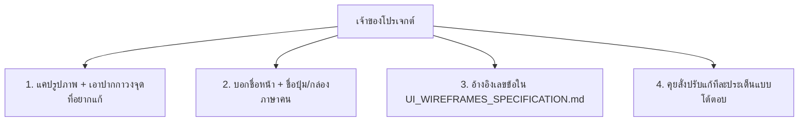

# PassSapa - Easy Feedback & Edit Request Guidelines (คู่มือการสั่งแก้จุดต่างๆ)

**วัตถุประสงค์**: แนะนำวิธีการสั่งงาน ปรับแก้ดีไซน์ หรือแก้ไขหน้าจอเป็นจุดๆ (Point-by-Point Edits) สำหรับเจ้าของโปรเจกต์แบบง่ายที่สุด โดยไม่ต้องรู้ศัพท์เทคนิค

---

## 🎨 4 วิธีง่ายๆ ในการสั่งแก้จุดต่างๆ ให้ AI เข้าใจ 100%

---

### 📷 วิธีที่ 1: แคปภาพหน้าจอแล้วเอาปากกาวง/เขียนสั่ง (แนะนำที่สุด! ⭐)
* **วิธีทำ**: คุณสามารถแคปรูปภาพหน้าจอ (Screenshot) แล้วใช้เครื่องมือในคอมพิวเตอร์หรือโทรศัพท์มือถือ **เอาปากกาวงจุดที่ต้องการแก้** พิมพ์ข้อความแปะไว้ในรูป แล้วแนบส่งภาพมาในแชทได้เลย!
* **ตัวอย่าง**: วงสีแดงตรงปุ่ม แล้วพิมพ์แปะว่า *"วงนี้อยากให้เปลี่ยนเป็นสีเขียวมรกตและปุ่มใหญ่ขึ้น"*
* **ผลลัพธ์**: AI สามารถอ่านและมองเห็นรูปภาพที่คุณส่งมา แล้วแก้ไขโค้ดตรงจุดนั้นให้ทันที!

---

### 🗣️ วิธีที่ 2: สั่งด้วยภาษาคน (บอกชื่อหน้า + ชื่อปุ่ม/ส่วนที่ต้องการแก้)
* **วิธีทำ**: พิมพ์บอกชื่อหน้าเว็บ และชื่อปุ่มหรือข้อความที่ต้องการเปลี่ยนเป็นภาษาพูดธรรมดา
* **ตัวอย่างประโยค**:
  * *"หน้าทำข้อสอบ: ตัวหนังสือตรงโจทย์อยากได้ขนาดใหญ่ขึ้นอีกนิด"*
  * *"หน้าแรก: ช่วยเปลี่ยนข้อความบนปุ่มจาก 'เริ่มเลย' เป็น 'ทดลองทำข้อสอบฟรี'"*
  * *"หน้าผลสอบ: อยากให้ย้ายกราฟจุดอ่อนขึ้นมาไว้ข้างบน"*

---

### 📄 วิธีที่ 3: อ้างอิงเลขหัวข้อในเอกสารสเปก
* **วิธีทำ**: เนื่องจากเรามีเอกสาร [UI_WIREFRAMES_SPECIFICATION.md](file:///d:/Antigravity/PassSapa/dev/docs/UI_WIREFRAMES_SPECIFICATION.md) คุณสามารถพิมพ์ระบุเลขข้อได้เลย
* **ตัวอย่างประโยค**: *"ขอปรับแก้หน้าจอที่ 2 Dashboard ข้อ 2.2 ตรง Quick Action Cards เพิ่มปุ่มใหม่..."*

---

### 💬 วิธีที่ 4: พิมพ์คุยโต้ตอบเพื่อระดมไอเดีย (Grill Me Mode)
* **วิธีทำ**: หากคุณยังไม่แน่ใจว่าอยากได้หน้าตาแบบไหน สามารถพิมพ์บอกผมว่า *"มาช่วยกันระดมไอเดียปรับหน้าทำข้อสอบกันหน่อย"* ผมจะเสนอทางเลือก A, B, C ให้คุณจิ้มเลือกได้ง่ายๆ ครับ!
